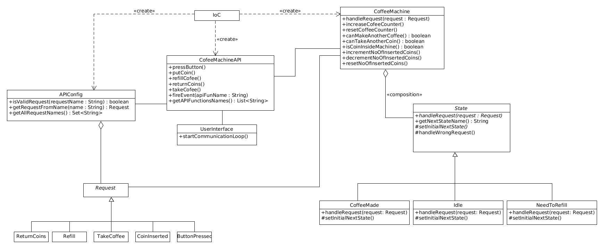

# Coffee Maker
AGH UST, Object-oriented programming assignment.

## Task description
Our task was to create an implementation of given feature based on the documentation prepared by other group. 
We were free to change anything in order to make the implementation better. 

## Program requirements
* Simple coffee machine
* handling with typical use-cases
* simplified using-conditions - for example user always puts a proper amount of coins in the machine
* simplified user interface and machine reactions

## Solution overview
### State machine diagram

### Class diagram

### Slides 
https://docs.google.com/presentation/d/1r3vGvQCxz7e9c07eqJ1FV0fpCWG8M97aYWUP8HoAG0c/edit?usp=sharing

